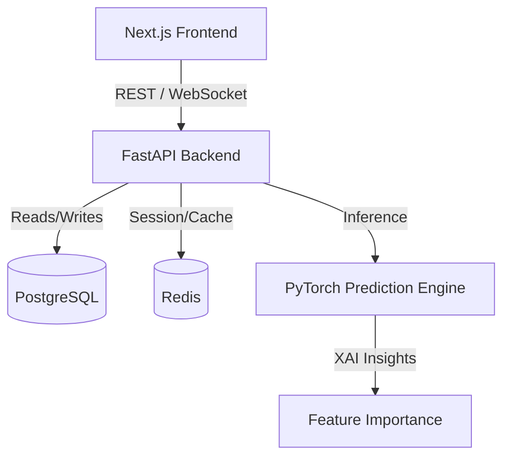

# NIFTY 50 Index Prediction System

[](https://fastapi.tiangolo.com/)
[](https://nextjs.org/)
[](https://pytorch.org/)

A production-ready multimodal deep learning platform for predicting NIFTY 50 Index movements. This project leverages technical indicators, news sentiment, and historical price action to generate highly transparent predictions using Explainable AI (XAI).

## Features

- 📊 **Real-Time Financial Dashboard**: View live NIFTY 50 charts and metrics.
- 🤖 **Multimodal Deep Learning Model**: Uses PyTorch to combine tabular data with sequence modeling.
- 🔍 **Explainable AI (XAI)**: Understand the *why* behind predictions through feature importance (SHAP values) and modality weights.
- 👤 **User Management System**: Track your own Watchlist, secure User Notes, and define custom Alerts.
- 🔐 **Secure Authentication**: Supports JWT-based email authentication and Google OAuth.

---

## Target Architecture

The application is structured into decoupled frontend and backend services suitable for microservices deployment:



## Quick Start

### 1. Prerequisites

Ensure you have the following installed:
- Python 3.11+
- Node.js 18+
- PostgreSQL 15+
- Redis (Optional but recommended for session cache)

### 2. Backend Setup
```bash
# Clone the repository
git clone <your-repo-url>
cd stock-market-prediction/backend

# Install dependencies
python -m venv .venv
source .venv/bin/activate  # On Windows: .venv\Scripts\activate
pip install -r requirements.txt

# Duplicate environment file
cp .env.example .env
# Edit the .env with your local credentials
```

### 3. Frontend Setup
```bash
cd ../frontend

# Install dependencies
npm install

# Setup environment config (if applicable)
# .env.local -> NEXT_PUBLIC_API_URL=http://localhost:8000
```

### 4. Running the Application

You can start both services using the provided bat script (Windows):
```bash
run_all.bat
```

Or manually:
- Backend: `uvicorn app.main:app --reload`
- Frontend: `npm run dev`

---

## Directory Structure
```
├── backend/            # FastAPI application logic
│   ├── app/            # System Core, APIs, DB Models, Schemas
│   └── tests/          # Unit tests
├── frontend/           # Next.js UI
│   ├── src/app/        # App router and page views
│   ├── src/components/ # Reusable UI components
│   └── src/lib/        # API client layer
├── training/           # Research Jupyter Notebooks for model training
├── models/             # Exported PyTorch (.pt) weights and scalers
└── docs/               # System architecture documentation
```

## Production Considerations
When moving this system to production, consider the following:
- **Environment Configuration**: Never use the default fallback secrets located in `app/config.py`. Expose them purely via your CI/CD runner or Docker secrets.
- **Background Tasks**: Replace FastAPI Background Tasks with Celery/Redis for intensive model re-training tasks.

## License
MIT License.
