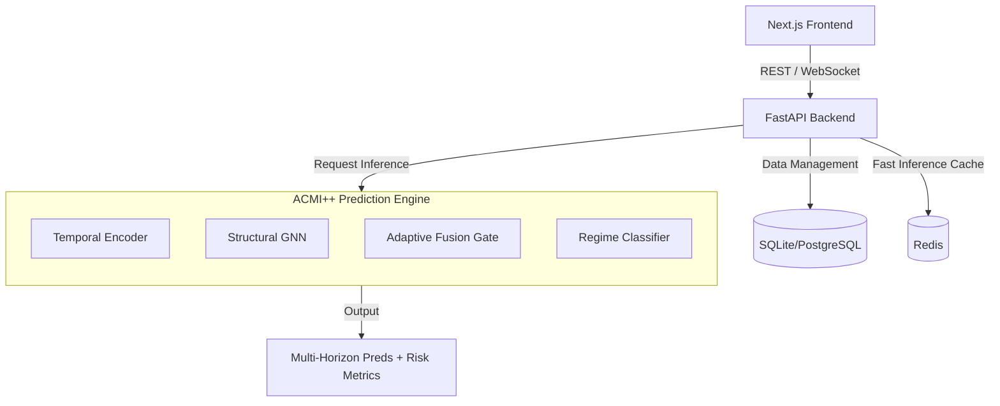

# NIFTY 50 ACMI++ Prediction System

[](https://fastapi.tiangolo.com/)
[](https://nextjs.org/)
[](https://pytorch.org/)
[](https://tailwindcss.com/)

A state-of-the-art, production-ready multimodal deep learning platform powered by the **ACMI++** (Adaptive Contextual Market Intelligence) architecture. This system predicts NIFTY 50 Index movements by fusing technical indicators, news sentiment, structural market data, and overnight signals from GIFT NIFTY.

---

## 🚀 Key Features (v2.0 ACMI++)

- 🧠 **ACMI++ Architecture**: A regime-conditioned model leveraging Temporal (TCN/TF), Technical, and Structural (GNN) embeddings for superior accuracy.
- 🕒 **Multi-Horizon Forecasting**: Simultaneous predictions for **1-day, 5-day, 20-day, and 60-day** intervals with 90% conformal confidence bands.
- 🌅 **GIFT NIFTY Integration**: Incorporates real-time overnight signals to predict opening gaps and early morning price action.
- 📊 **Market Regime Classification**: Automatically identifies market states: `Bullish`, `Bearish`, `Sideways`, `High Volatility`, or `Unknown`.
- 🛡️ **Risk & Volatility Insights**: Integrated forecasts for **Crash Probability** and **Expected Volatility** to aid in capital preservation.
- 🔍 **Intrinsic Explainability**: Dynamic fusion weights provide real-time attribution, showing exactly how much the model relied on each data modality.
- 📈 **Real-Time Dashboard**: High-fidelity visualization of live NIFTY 50 metrics, progress bars for confidence, and interactive charts.

---

## 🏗️ System Architecture

The application uses a decoupled microservices-ready architecture:



---

## 📂 Directory Structure

```
├── backend/            # FastAPI application logic
│   ├── app/            # System Core, APIs, DB Models, Schemas
│   │   ├── ml/         # ACMI++ Model Architectures (TCN, GNN, Fusion)
│   │   └── services/   # Inference Wrappers & Business Logic
│   └── tests/          # E2E & Unit tests (Allure integrated)
├── frontend/           # Next.js 14+ UI (App Router)
│   ├── src/app/        # Dashboard, Live Chart, Prediction views
│   ├── src/components/ # Premium UI Components (Shadcn/UI inspired)
│   └── src/lib/        # API Client & State Management (Zustand)
├── models/             # Trained Weights (.pt) & Feature Scalers
├── training/           # ACMI++ Research & Training Pipelines (Jupyter)
└── Documentation/      # System Design & Research Papers
```

---

## 🛠️ Quick Start

### 1. Prerequisites
- **Python 3.11+**
- **Node.js 18+**
- **SQLite** (or PostgreSQL for production)
- **Redis** (Highly recommended for inference caching)

### 2. Installation & Setup
The project includes a comprehensive setup script for Windows:
```bash
# Clone the repository
git clone <your-repo-url>
cd stock-market-prediction

# Run the automated setup
setup.bat
```

### 3. Running the System
Start both the backend and frontend services simultaneously:
```bash
run_all.bat
```

---

## 🧪 Testing & Quality Assurance
The system includes a robust E2E testing suite with **Allure Reporting**:
- **Chatbot Verification**: Automated tests for bot interaction and response accuracy.
- **API Stability**: Validation of inference latency and schema integrity.
- **UI Consistency**: Visual regression testing for the NIFTY 50 dashboard.

---

## 🛡️ License
Distributed under the **MIT License**. See `LICENSE` for more information.

